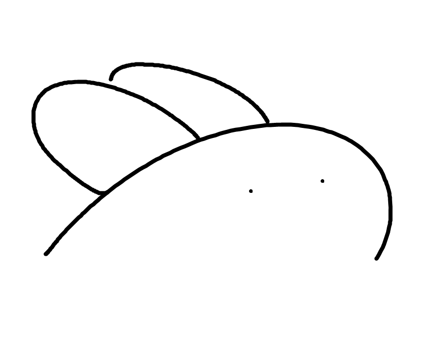
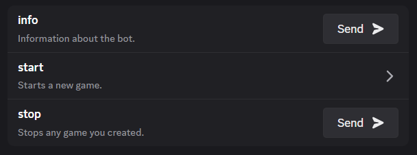
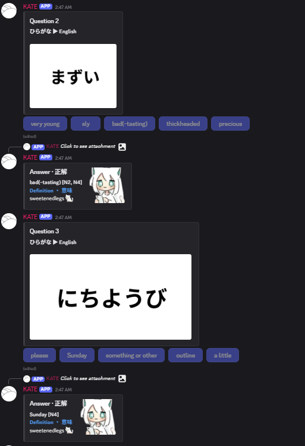
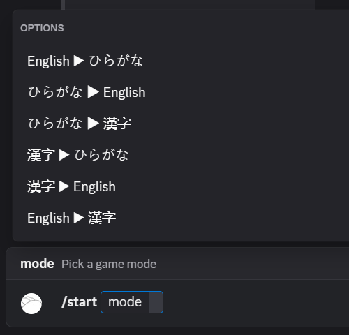

<h1 align="center">KATE Bot</h1>

<h4 align="center">Play English-to-Japanese (and vice-versa) quizzes with friends!</h4>

<h2 align="center">
  <a href="https://discord.com/oauth2/authorize?client_id=1377200004124512320" target="_blank">
        Invite Link
    </a>
</h2>

<h2 id="commands">🤖 Commands</h2>

<h2 id="preview">🎴 Preview</h2>

<h2 id="attrib">📑 Attributions</h2>

- Consultation - Legs
- Emotes - [@matcha__ore_p](https://x.com/matcha__ore_p/)
